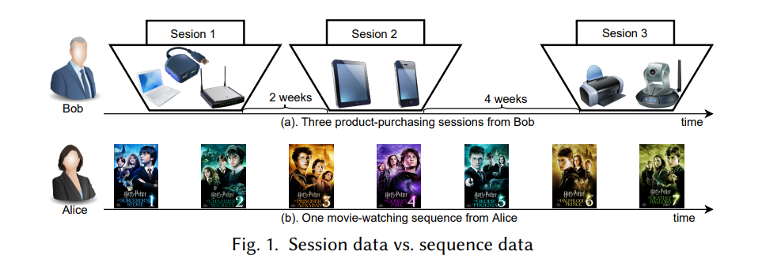

# Session-based-Rec-Papers
Papers of Session-based Recommendation from top conf/journals.

 This repo mainly collects some papers on the Session-based Recommendation research (also includes some papers about Sequential recommendataion) from the top conference (e.g. KDD, CIKM and AAAI) and journals.

 We will update the latest published papers... 

> [**Sequential Recommendation v.s Session-Based Recomendation**](https://arxiv.org/abs/1902.04864)
SBRSs and SRSs are built on session data and sequence data respectively, while they are often
mixed up by some readers. So it is necessary to first clarify the difference between session data and sequence data. A session is a list of interactions with a clear boundary, while the interactions may be chronologically ordered (in ordered sessions), or unordered (in unordered sessions).

-----

  ### Review Paper List
|  Title  |   Key Contributions    |  Source  |
| :----  |   ----  | ----  |
| [Performance Comparison of Neural and Non-Neural Approaches to Session-based Recommendation](http://citeseerx.ist.psu.edu/viewdoc/download?doi=10.1.1.473.9437&rep=rep1&type=pdf) | detailed datasets and benchmarks of session-based rec | Recsys'2019 |
| [Performance Comparison of Neural and Non-Neural Approaches to Session-based Recommendation](/survey/Sequential%20Recommender%20Systems-%20Challenges,%20Progress%20and%20Prospects.pdf)| a brief survey of Sequentail Rec| IJCAI'2019 |
|[A Survey on Session-based Recommender Systems](https://arxiv.org/abs/1902.04864)| A detailed survey about sbr | | 
|[Deep Learning for Sequential Recommendation: Algorithms,Influential Factors, and Evaluations](./survey/surveypdf.pdf)| | ACM Transactions on Information Systems, 2020| 
-----

### Research Paper List

#### GNN-based Methods

|  Title     |   Key Contributions    |  Source  | Chinese Blogs| original code |
|  :----  |  ----  | ----  | ---- | ---- |
| [Self-Supervised Hypergraph Convolutional Networks for Session-based Recommendation](https://arxiv.org/pdf/2012.06852.pdf)|  Global **HyperGraph**  + session-level graph construction | AAAI'2020| ||
|[Handling Information Loss of Graph Neural Networks for Session-based Recommendation](http://www.cse.ust.hk/~raywong/paper/kdd20-informationLoss-GNN.pdf)| session to **Egde order preserved** Multi-graph & **short-cut** graph | KDD'2020| [jianshu](https://www.jianshu.com/p/674fbc3f548a) ||
|[Memory Augmented Graph Neural Networks for Sequential Recommendation](https://ojs.aaai.org/index.php/AAAI/article/download/5945/5801)| short-term user preference (gnn) & long-term preference (shared memory network)    |AAAI'2020| ||
|[DGTN: Dual-channel Graph Transition Network for Session-based Recommendation](https://arxiv.org/pdf/2009.10002.pdf) | model complex transitions between items in different sessions: integrate the target session and  neighbor (similar) sessions into a single graph: (**Intra-session  & Inter-session GNN**) | arxiv |||
|[Cross-Session Aware Temporal Convolutional Network for Session-based Recommendation](GNN-based/Cross-Session%20Aware%20Temporal%20Convolutional%20Network%20for%20Session-based%20Recommendation.pdf)| | 2020 ICDM *wokshop* | ||
|[Global Context Enhanced Graph Neural Networks for Session-based Recommendation](https://arxiv.org/pdf/2106.05081.pdf)| **global context enhanced graph** (neighbor sampling) + session graph | SIGIR'2020| [jianshu](https://www.jianshu.com/p/f843ac348a37) ||
|[Star Graph Neural Networks for Session-based Recommendation](GNN-based/StarGNN.pdf)| capture the item relationship without direct connections, **add virutal node (session-level)** to connect with all items in the current session  |CIKM'2020|||
| [Temporal Augmented Graph Neural Networks for Session-Based Recommendations](https://www4.comp.polyu.edu.hk/~xiaohuang/docs/Huachi_sigir2021.pdf)| build **dynamic graphs** (constructs a graph for each day and merge nodes based on temporal infomation) to capture the drifting user interests| SIGIR'2021 *short*|||
| | | |||
| | | |||
| | | |||
